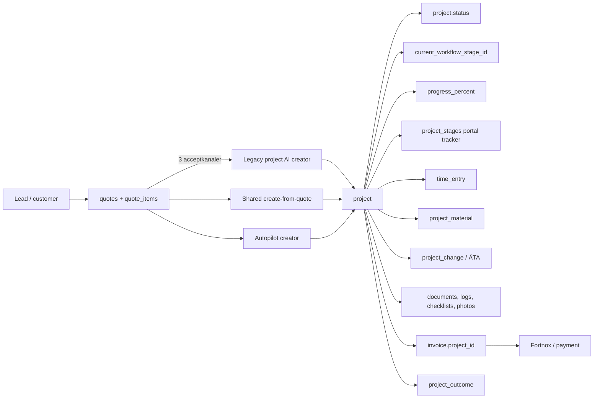
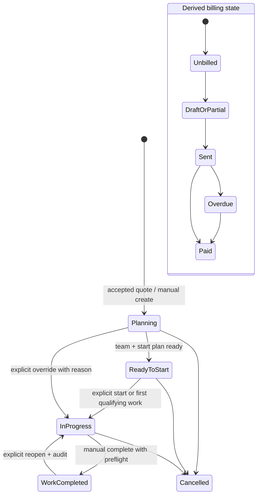

# Handymate Project System Audit

**Granskningsdatum:** 2026-08-07  
**Omfattning:** read-only granskning av aktuell arbetskopia, SQL-historik, relevanta tester och senaste commits.  
**Avgränsning:** ingen produktionskod, migration eller roadmap har ändrats. `docs/council/ACTIVE_ROADMAP.md` har uttryckligen lämnats orörd.

## 1. Executive Summary

Projektmodulen är bred och innehåller mycket verklig funktionalitet: offertkoppling, tid, material, ÄTA, milstolpar, dokumentation, ekonomi, fakturor, efterkalkyl, bokningar, team, kundportal och agentåtgärder. Den är däremot ännu inte en tillförlitlig operativ källa till sanning.

De centrala svaren är:

| Fråga | Svar | Kort evidens |
|---|---|---|
| A. Skapar accepterad offert tillförlitligt exakt ett korrekt projekt? | **PARTIALLY** | Tre acceptflöden anropar upp till tre olika projektskapare i olika ordning. De gör endast kontroll-före-insert och databasen saknar unik offert→projekt-regel. Resultatet skiljer sig per kanal. |
| B. Är projektrelaterade automationer tillförlitliga? | **PARTIALLY** | Många är inkopplade, men kritiska sidoeffekter är icke-atomiska, non-blocking och ofta osynliga vid fel. Fakturastage söker dessutom via en projektkolumn som inte finns. |
| C. Är nuvarande stage-logik genuint dynamisk? | **NO** | Det finns flera konkurrerande stage/statusmodeller. Nya projekt initierar normalt inte `current_workflow_stage_id`; första arbete flyttar inte säkert stage; faktura/betalning kan inte hitta projektet via nuvarande helper. |
| D. Varför ser progress ut att fastna? | **Flera samverkande rotorsaker** | Stage startar som `NULL`; progress skrivs av två oförenliga algoritmer; check-in/out, edit och delete räknar inte om progress; slutförande sätter inte säkert 100%; stage-modal uppdaterar inte föräldrasidan; listan hämtar inte workflow-stage. |
| E. Är projektlistan bra nog som operativ central? | **NO** | Den visar mycket data men saknar verklig stage, fakturastatus, tydlig nästa åtgärd, uppmärksamhetsgruppering och pålitlig progress. |

### De fem högst prioriterade åtgärderna

1. **Stäng tenant-riskerna först:** verifiera produktionens RLS och tenant-säkra alla service-role-mutationer, särskilt projekt-delete, projekt/ÄTA-skapande och fakturakällor.
2. **Gör offertacceptans till en enda idempotent finalisering:** en kanonisk skapare, databasunik offertkoppling och synlig reparationskö.
3. **Välj en lifecycle-sanning:** lagrat arbetsläge, härledd ekonomisk status och ett enda transition-API; initiera och tolka historiska projekt deterministiskt.
4. **Laga completion→invoice→payment-kedjan:** modern `quote_items`, tid/material/ÄTA, korrekt `invoice.project_id`, transaktion/reconciliation och ärliga resultat.
5. **Ersätt falsk progress med förklarbar progress och nästa åtgärd:** härledd read model som används av både lista, detalj och portal.

### Vad Claude bör implementera först

Claude bör börja med en liten säkerhets- och invariant-sprint, därefter konsolidera offert→projekt innan någon UI-förfining. Exakt ordning finns i avsnitt 20. Projekt-Autopilot, fler stages och bred agentfunktionalitet bör inte byggas ovanpå nuvarande splittrade lifecycle.

## 2. Current Architecture

### Faktisk domänbild

Det finns alltså inte en Project-lifecycle utan flera överlappande modeller:

- `project.status` beskriver grovt arbetsläge men är fri text utan verifierad DB-check.
- `project.current_workflow_stage_id` pekar på en åttastegsmodell för automation och UI.
- `project.progress_percent` är ett lagrat tal som flera writers skriver med olika innebörd.
- `project_stages` är en separat femstegs-checklista för kundportalen.
- milstolpars `status` och `ai_progress_percent` utgör ytterligare progress-signaler.
- fakturastatus ligger korrekt på `invoice`, men workflow försöker även spegla den till projektstage.

### Databas- och åtkomstkarta

RLS-bedömningen nedan avser SQL-filerna i repositoryt. Eftersom flera migrationer är avsedda att köras manuellt och vissa använder `IF NOT EXISTS`/exception-block är en faktisk produktionsdump av `pg_policies`, constraints och triggers obligatorisk innan implementation.

| Tabell / fält | Syfte och nyckel | Tenant/FK/status | Writers → readers | RLS i repo |
|---|---|---|---|---|
| `project` | Projektets huvudrad. PK `project_id` (TEXT). | `business_id`; länkar till customer, quote, lead, deal. `status`, `progress_percent`, `completed_at`, workflow-, health- och actual-fält. Quote-länk saknar unik regel. | Många creators/API/booking → lista, detalj, portal, ekonomi, agenter. | **Osäker/farlig:** grundpolicy `FOR ALL USING (true)`. |
| `project_milestone` | Planerade delmoment. PK `milestone_id`. | `business_id`, `project_id`; `status`, `completed_at`, budget och AI-progress. | Projekt- och quote-creators, milestone-route → detalj, progress, workflow. | **Öppen** grundpolicy. |
| `project_change` | ÄTA/change orders. PK `change_id`. | `business_id`, `project_id`, customer/quote/invoice-id; draft→sent→signed/approved→invoiced, men två API:er tillämpar olika regler. | Två ÄTA-routefamiljer, signering, final invoice → projekt, portal, Revenue Recovery. | **Öppen** grundpolicy. |
| `time_entry` | Faktisk tid, GPS, kostnad, fakturering. PK `time_entry_id`. | `business_id`; project/customer/user/booking/milestone. `approval_status`, `invoiced`, `invoice_id`. | API, check-in/out och vissa klientflöden → projekt, lönsamhet, invoice. | **Öppen** grundpolicy; senare FK till project finns i v71-filen men produktion måste verifieras. |
| `project_material` | Projektmaterial och inköp/sälj. PK `material_id`. | `business_id`, `project_id`, `invoiced`, `invoice_id`; ingen verifierad FK i slutlig facit. | Material-route/klient → detalj, profitability, invoice, missed revenue. | **Öppen** policy i `supplier_connections.sql`. |
| `invoice` | Kundfaktura, items JSONB, total, status, payment/Fortnox. PK `invoice_id`. | `business_id`, customer, nullable `project_id`, quote. `project_id` lades till utan verifierad FK; historiska rader kan vara orphan. | Flera invoice-creators/Fortnox → ekonomi, stage, Revenue Recovery. | Policyhistoriken måste verifieras i produktion; serverroutes använder service role. |
| `supplier_invoices` | Leverantörskostnad kopplad till projekt. | PK `id`, `business_id`, nullable project och status. | Projektmodal/API → kostnads- och marginalvyer. | **Öppen** repo-policy. |
| `project_assignment` | Team per projekt. PK `id`. | `business_id`, project, business user, role. | Projektlista/detalj och direkta klientwrites → routing och UI. | **Öppen** repo-policy. |
| `booking` | Schemalagt besök/jobbtillfälle. | PK `booking_id`, `business_id`, nullable `project_id`, `job_status`, `completed_at`. | Booking API/mobile → day progress och projektslutförande. | Måste verifieras; serverkod tenantfiltrerar de viktigaste läsningarna. |
| `schedule_entry` | Resursplanering. PK `id`. | Riktiga FKs till business user/project; `status`. | Schedule API/UI → projektportal/nästa besök. | Service-role full access + användarpolicyhistorik; verifiera employee-paritet. |
| `project_document` / `project_photos` | Bevis, filer och foton. | Project/business; dokument har `document_id`, foton `id`. | Upload/API/klient/AI → detalj och portal. | Grundpolicys är öppna eller owner-only beroende tabell/version. `project_document` har dessutom möjlig NOT NULL/`SET NULL`-migrationskonflikt. |
| `project_log` | Byggdagbok. PK `log_id`; både `project_id`/historiskt `order_id` förekommer i kod. | Business/project, datum, arbete, väder, bilder. | Log routes/klient → detalj, portal. | Grundpolicy öppen. |
| `project_checklist` | Egenkontroll/checklistor. PK `checklist_id`. | Business/project, items JSONB, status. | Checklist routes/agent → detalj och nästa åtgärd. | Grundpolicy öppen. |
| `task` | Generiska tasks för deal/customer/project. PK `id`. | `business_id`, `project_id`, status/priority/assignee. | Task API och stage-modal → todo UI. | Repo-policy matchar endast `business_config.user_id`; employee-stöd måste verifieras. |
| `project_workflow_stages` | Metadata för åtta workflow-stages. PK `id`. | Systemrad eller `business_id`, position/name. | Seed/admin → stage engine/modal/statuskort. | Owner-baserad user policy, service role i API. |
| `project_stage_automations` | Automationer per workflow-stage. PK `id`. | Business/stage, action, delay, aktiv. | Settings/seed → stage engine och approvals. | Owner-baserad policy. |
| `project_stages` | Separat portal-tracker: quote accepted/material/work/inspection/done. | PK `id`, unique project+stage, completed-at/by. | `/api/projects/[id]/stages` → kundportal. | Service role + owner-baserad user policy. |
| `project_events` | Matte-konversationers projekttidslinje. PK UUID `id`. | Business/project, fri `type`, metadata. | Konversationsintelligens → tidslinje. | Service role + owner-baserad policy; inte lifecycle source of truth. |
| `project_ai_log` | AI-projektledarens aktiviteter/varningar. PK `id`. | Business/project/event/action/metadata. | `project-ai-engine` → AI/health UI. | **Öppen** repo-policy. |
| `v3_automation_logs` | Generella automationsloggar. PK `id`. | Business, trigger/action/status/context. | Automationer/stage → flöde och audit UI. | Separat historik; inte transaktionell med projektwrite. |
| `pending_approvals` | Human approval queue. PK `id`. | Business, approval type, payload, routing, status. | Autopilot/stages/agenter/completion → approvals UI/cron. | Senare v77-policy är betydligt bättre; produktion måste verifieras. |
| `project_cost` | UE/övriga kostnader. PK `id`. | Business/project/category/amount. | Cost route → profitability. | Ingen tydlig säker policy i samma migrationsfil; verifiera. |
| `project_outcome` | Frusen efterkalkyl, en rad per projekt. | PK/id + unique project, business, quoted/actual/invoiced/margin. | Completion/freezer → efterkalkyl/agentinsikter. | Nyare tenantpolicy, men owner-only snarare än teammedlemskap. |

### Arkitektoniskt nuläge

Styrkan är att mycket av den nödvändiga datan redan finns. Problemet är inte brist på en ny workflow-motor; problemet är att samma affärshändelse kan skrivas av flera vägar utan gemensam invariant, transaktion eller reconciliation.

### Relevant commitkontext

Granskningen tog särskilt hänsyn till följande nyliga ändringar, men verifierade alltid slutlig kod i arbetskopian:

| Commit | Relevans för audit |
|---|---|
| `5bccc772` (2026-07-10) | Lagade den tidigare helt döda workflow-stage-flytten som använde en ogiltig PostgREST-embed. |
| `d7c1e652`, `fd48057b`, `37a9f754` (2026-07-31) | Ny Project detail-struktur, ekonomipresentation och fakturapanel. |
| `76e298e9`, `89965e8c` (2026-08-04) | Gemensam invoice-kärna och ny invoice creator-UI. |
| `f5ccc01d`, `2aec93aa` (2026-08-03) | ÄTA-kedja och project-completion/agentkopplingar. |
| `3a973b45` (2026-08-06) | Permissionsgrindar på flera money/persondata-routes; täcker inte alla project-muteringar eller RLS. |
| `6a305a3b`, `a1561feb` (2026-08-05/07) | Reparerade flera tysta schema-/kolumnfel. Den kvarvarande `project.invoice_id`-frågan visar att column-contract-skyddet ännu inte täcker alla dynamiska querymönster. |
| `98a4268e` (2026-08-07) | Pågående offert/agentarbete i aktuell kodbas; ändrar inte behovet av canonical project finalization. |

## 3. Project Creation Paths

Följande projektskapare hittades. Ingen dedikerad import-, clone- eller cron-baserad projektskapare hittades utöver demo/seed och nedanstående automationer.

| Creation path | Trigger | Code location | Required inputs | Resulting project fields | Initial stage/status | Quote link | Customer link | Tenant link | Idempotent? | Audited? | Risk |
|---|---|---|---|---|---|---|---|---|---|---|---|
| Legacy AI quote creator | `handleProjectEvent('quote_accepted')` | `lib/project-ai-engine.ts` | business + accepted quote id | Minimal budget från legacy JSONB, `start_date=today`, AI-health/auto-created | `active`; workflow `NULL` | Ja | Ja | business från event; quote scoped | Endast app-check; racebar | AI-logg/notification, inte canonical event | **Kritisk:** vinner normalt i intern/public accept och gör rik creator till no-op. |
| Shared quote creator | Shared finalizer efter sign/accept | `lib/projects/create-from-quote.ts`, `lib/quotes/finalize-accepted.ts` | business + accepted quote id | Modern budget/type, address, lead, source, valfria milestones/checklista | `active`; workflow `NULL` | Ja | Ja | Quote är business-scoped; customer-fetch saknar business-filter | App-check; racebar | `project_created`, notifications | Bästa vägen men stage, project number och deal saknas. |
| Autopilot creator | Autopilot enabled efter accept | `lib/autopilot/trigger.ts` | business + quote + feature/config | Minimal project före package med booking/SMS/material actions | `active`; workflow `NULL` | Ja | Ja | Business skickas in; quote embed är schema-känslig | App-check; racebar | Approval/notification | Kan vinna före shared creator; channel-dependent shape. |
| Manual project | Dashboard “Nytt projekt” | `POST app/api/projects/route.ts` | name; valfri customer/dates/budget/team | Project number, manual fields, valfria milestones | `planning`; workflow `NULL` | Nej normalt | Valfri | Business från auth men customer-id valideras inte mot tenant | Nej | Ingen konsekvent lifecycle-event | Cross-tenant FK-risk; ingen explicit create-project permission. |
| Manual from quote | “Skapa projekt” även på accepted quote | Samma POST med `from_quote_id` | quote id + ev. overrides | Modern budget/milstolpar men mindre provenance/address än shared creator | `planning`; workflow `NULL` | Ja | Via quote/body | Quote scoped, body customer risk | **Nej** | Ojämt | Direkt dubblettrisk efter automatisk creation. |
| Pipeline Won modal | User slutför won-modal | Pipeline UI → manual project POST | deal och ev. quote/customer | Samma som manual/from-quote | `planning`; workflow `NULL` | Ibland | Ibland | API quote/deal scoped | UI-guard, ingen DB-garanti | Ojämt | Dubblett vid stale deal↔project-länk. |
| Lead/pipeline automation | `create_project` action/stage | `lib/projects/create-from-lead.ts` | business + lead id | Lead snapshot; legacy quote budget/milstolpar | `active`; workflow `NULL` | Senaste signed/accepted/**sent** quote | Via lead | Lead/quote business-scoped | App-check på lead; racebar | `project_created`, notifications | Kan välja osignerad quote och tom modern budget. |
| E2E Deal Flow | Deal-flow project step | `lib/e2e-deal-flow.ts` | business + deal/quote/customer context | Legacy quote-derived project; deal linked separat | `active`; workflow `NULL` | Ja om tillgänglig | Ja | Input/business queries | App-check på deal | E2E activity | Insert och deal update är inte atomiska. |
| Booking fallback | Booking skapas för offertlöst jobb | `lib/projects/maybe-create-from-booking.ts` | business + customer + booking | Via latest lead eller minimal hourly project | `active`; workflow `NULL` | Möjligen via lead | Ja | Huvudguards scoped; customer-fetch/booking-update inte scoped | Grov customer/lead-guard | `project_created` endast minimal/lead helper | Existing active project länkas inte till booking; planning ignoreras. |
| Template project | Project template apply/create | Template branch i project POST | template + name/customer/dates | Template budget/type + milestones | `planning`; workflow `NULL` | Nej | Valfri | Business från auth, customer ej verifierad | Nej | Ingen canonical event | Tenant/lifecycle-init saknas. |
| Demo/sample seed | Demo onboarding | `lib/demo/seed-demo-account.ts` | demo business fixture | Direktinserts med sample values | Fixture-specific | Fixture | Fixture | Demo business | Seed-specifik | Seedlogik | Kan maskera runtime-luckor i demo. |

Strukturellt likvärdiga projekt skapas alltså inte idag. Minst status, startdatum, budgetkälla, address, milestones, lead/deal, project number, workflow-stage, event och checklistförslag varierar med skapelsekanal.

## 4. Quote → Project Handoff

### Faktisk acceptkedja

| Kanal | Quote-write | Efterföljande ordning | Synligt fel om project misslyckas? |
|---|---|---|---|
| Intern accept: `/api/quotes/accept` | Business-scope och statuskontroll; sätter accepted. | legacy project AI → `quote_accepted` event → deal/SMS → shared creator → Autopilot. | **Nej.** Endpoint kan svara success trots project-fel och använder inte shared failure-repair. |
| Publik signering: `/api/quotes/public/[token]` | Tokenbaserad sign/accept. | legacy project AI → `quote_signed` event → Autopilot → shared finalizer. | Delvis: finalizer kan skapa `manual_project_create`, men legacy/autopilot kan redan ha skapat sämre rad. |
| Kundportal: `/api/portal`, `accept_quote` | Villkorad update mot öppna statusar och customer/business. | `quote_signed` → notification → Autopilot → shared finalizer. | Delvis: repair approval via finalizer, men Autopilot kan vinna först. |

### Slutsats

**PARTIALLY:** en accepterad offert leder ofta till ett projekt, men det finns ingen garanti för **exakt ett korrekt** projekt.

- Ingen unik constraint/index säkrar en primary project per quote.
- Alla creators använder mönstret SELECT-then-INSERT, vilket är racebart.
- Intern och publik accept kör legacy creator först; shared creator returnerar sedan “already existed”.
- Portal med Autopilot kan låta Autopilot creator vinna före shared creator.
- Quote-detaljen visar fortfarande “Skapa projekt” och den manuella POST-routen saknar dedup.
- Post-accept-fel är övervägande non-blocking; affärshändelsen accepterad kan därför sakna komplett projekt utan att användaren ser det.

### Dataöverföring

| Quote-data | Shared creator | Legacy/Autopilot | Rekommendation |
|---|---|---|---|
| Customer / business | Ja | Ja | Behåll FK/länk och validera samma tenant. |
| Quote trace | `quote_id` | Vanligen ja | Gör unik primary-länk och oföränderlig provenance. |
| Title | Ja | Ja | Kopiera som initial projektnamn; därefter redigerbart. |
| Address | `project_address` | Vanligen nej | Snapshot på projekt är rimlig eftersom arbetsadress kan avvika från kundadress. |
| Description/scope | Nej som project description | Ojämt | Behåll offertdokumentet länkat; kopiera endast kort scope-summary om UI behöver det. |
| Accepted amount | Budgethelper / total fallback | Legacy total/ibland bara total | En gemensam budgetderivering måste användas av alla vägar. |
| Line items | Länkas; används för budget/milstolpar | Legacy JSONB | Duplicera inte hela offerten till projekt; använd versionerad accepted quote som baseline. |
| Labor/estimated hours | Ja via modern helper | Ofta nej | Baseline ska komma från accepted quote version. |
| Materials | Ingår i budget men ingen separat planned-materialmodell | Autopilot kan föreslå material | Skilj planerade offertmaterial från faktiskt `project_material`. |
| ROT/RUT, payment terms | Finns endast via quote-länk | Ojämt | Ska inte dupliceras utan dokumenterat snapshotbehov. |
| Dates/duration | Nej | Legacy sätter felaktigt start idag | Ska anges i planning eller bokning; accept är inte arbetsstart. |
| Notes/attachments/photos | Inte kopierade | Nej | Behåll evidens länkat till quote/customer; exponera i projektkontext. |
| Team | Nej | Autopilot package kan föreslå | Planning-signal, inte accept-sanning. |
| Deal | Shared creator sätter inte `deal_id` | E2E gör separat write | Resolva deterministiskt och länka inom samma finalisering. |
| Project number | Shared creator sätter inte | Manual route gör | Gemensam skaparkärna ska generera konsekvent nummer. |
| Workflow stage | Ingen initiering | Ingen initiering | Initiera atomiskt till PLANNING/CONTRACT_ACCEPTED-semantik. |

### Information som inte bör dupliceras

Accepted quote version, line items, terms, ROT/RUT-beslut, signatur och bilagor bör vara immutable baseline och nås via `quote_id`/version, inte bli en andra redigerbar kopia på projektet. Projektet behöver snapshots endast för operativt föränderliga fakta: arbetsadress, planerade datum, team och genomförandeplan.

## 5. Automation Audit

| Trigger | Expected behavior | Exists / invoked? | Idempotency | Failure mode | Retry | Logging | User visibility |
|---|---|---|---|---|---|---|---|
| Quote accepted/signed | Finalize quote, one project, move deal, notify | Ja, men kanalnamnen är `quote_accepted`/`quote_signed` och ordningen skiljer | Ingen gemensam key; creators app-dedup | Project/notification kan faila efter accepted-write | Finalizer kan skapa repair approval i två kanaler; intern accept saknar den | Blandat event/console/activity | Oftast endast quote success |
| Project created | Initiera lifecycle, checklist, audit | Event endast från vissa creators | Ingen canonical event-idempotens | Stage/event/checklist saknas beroende kanal | Ingen generell | `project_created` ibland | Project row syns, men ofullständighet döljs |
| Workflow init | Sätt första giltiga stage | **Nej** i creators | — | `NULL` maskeras som Planning | Ingen | Ingen | UI ser legitimt ut |
| Owner/customer notify | Informera om vunnet jobb/portal | Ja i flera creators | Ingen gemensam dedup | Dubbla SMS eller “startat” innan arbete | Ingen robust delivery retry | SMS-logg varierar; console fallback | SMS kan motsäga DB-state |
| Checklist suggestion | Föreslå egenkontroll | Ja på vissa paths | Helper guard | Approval kan saknas | Nästa explicit trigger/ingen | Console/approval | Kanalberoende |
| Booking/staff package | Skapa/föreslå planering | Autopilot approval + booking API | Approval har id, package kan skapas efter varierande project | Partial package/project | Approval kan hanteras manuellt | Approval/audit | Synligt om approval insert lyckas |
| First work activity | Flytta work state till in progress | **Inte generellt**; normal time POST kör endast progress/health | — | Check-in/out/edit och andra writers divergerar | Ingen | AI-logg endast normal POST | Stage förblir stuck |
| Milestone completed | Progress och workflow advance | Ja i milestone PUT | Samma stage no-op | Writes är ej atomiska; kan regress/lost history | Manuell retry | Console/stage log | Milestone kan vara klar medan stage inte är det |
| Project completed | Work complete, invoice/outcome/review/deal | Manual PUT + final booking | Ingen säker previous-state/idempotency för alla side effects | Partial completion; booking kan returnera false success | Ingen persistent reconciliation | Console + vissa events | Project visar completed även när följdsteg saknas |
| Invoice created | Link invoice and mark sources | Ja, men inte från alla paths med samma event/link | Invoice-number core bättre; source allocation ej atomisk | Orphan/half allocation | Manuell | `invoice_created` bara vissa paths | Invoice kan synas, sources fortfarande unbilled |
| Invoice sent | Delivery + billing state | Ja | Send kan upprepas; delivery dedup ej gemensam | Status kan vara sent före leverans; project lookup död | Manuell/cron beroende kanal | Send results/console | Kan felaktigt visa sent |
| Payment/Fortnox | Invoice paid + project financial state | Ja, manual och sync | Invoice paid i praktiken idempotent | Project stage missas via `project.invoice_id`; side effects fail-soft | Nästa Fortnox sync för invoice, inte full project reconciliation | Sync errors/console | Invoice paid men project kan stå kvar |
| Outcome freeze | Snapshot offer-to-reality | Ja vid två completion paths | Upsert/deterministic id | Kan frysa innan sena invoices/costs | Getter kan frysa igen, men semantics oklar | Console | Ingen tydlig “preliminär/final” distinction |

### Eventkonsistens

Repositoryt använder bland annat `quote_accepted`, `quote_signed`, `project_created`, `job_completed`, `invoice_created`, `invoice_sent`, `invoice_paid`, `payment_received`, `ata_sent` och `ata_signed`. Namnen går till olika motorer: V3 automation, smart communication, project AI, stage engine och agent trigger.

Rekommendationen är **inte** en ny persistent eventplattform. Inför först en liten typed/static registry med kanoniska namn och adapter-alias för befintliga consumers. Varje affärsroute ska ha en dokumenterad canonical event och ett idempotency key. Skriv event/outbox endast där en kritisk sidoeffekt annars kan tappas; loggtabeller ska inte användas som källa till sanning.

## 6. Stage & Progress Audit

### Faktiska status- och stagevärden

- `project.status` används i UI som `planning`, `active`, `paused`, `completed`, `cancelled`. Andra readers söker även `done`, `invoiced` eller generiska “not completed”, vilket visar att kontraktet inte är slutet.
- `project_workflow_stages` har `ps-01`–`ps-08`: Kontrakt signerat, Startmöte bokat, Jobb påbörjat, Delmål uppnått, Slutbesiktning, Faktura skickad, Faktura betald, Recension mottagen.
- `project_stages` har separata portalvärden: `quote_accepted`, `material`, `work_started`, `inspection`, `done`.
- `project_milestone.status` använder `pending`, `in_progress`, `completed` i olika kodvägar.
- `project.progress_percent` kan skrivas manuellt, av time AI och av milestone-routen.

### Source of truth

Det finns ingen entydig source of truth:

- Listan filtrerar och visar `project.status` samt `progress_percent`, men hämtar inte workflow-stage.
- Detaljens nya trestegs-stepper använder `current_workflow_stage_id` och mappar `NULL` till första positionen/Planering.
- Detaljens statusdropdown uppdaterar `project.status` och försöker därefter flytta workflow-stage.
- Kundportalen visar `project.progress_percent` och den separata `project_stages`-trackern.
- Fakturans verkliga state ligger på invoice men speglas avsiktligt till workflow-stage.

### Konkreta transitioner som spårades

1. **Accepted quote → project:** project skapas som `active`, men skaparrouten går inte genom project PUT och initierar inte workflow-stage. Resultat: `status=active`, `current_workflow_stage_id=NULL`.
2. **Booking created → start meeting:** booking-routen flyttar till `ps-02` endast under vissa förutsättningar; ett null-initialiserat eller felaktigt projekt har ingen robust föregående semantics.
3. **Time logged → in progress:** vanlig time-entry POST uppdaterar ett budgetförbrukningsbaserat progressvärde via project AI, men flyttar inte workflow-stage. Check-in/out använder andra writes och anropar inte samma progress/stage-logik.
4. **Milestone completed:** milestone PUT skriver progress som completed-count/total och flyttar till `ps-04` eller `ps-05`. Det kan skriva över en högre time-baserad progress med en lägre siffra.
5. **Project status active/completed:** project PUT flyttar till `ps-03`/`ps-05`, men endast när denna route används. Direkta creators och booking-completion delar inte exakt samma kontrakt.
6. **Invoice sent/paid:** alla viktiga callers använder invoice-id-lookup, men lookupen filtrerar `project.invoice_id`, som inte finns; verklig relation är `invoice.project_id`.
7. **Manual stage:** stage-modal tillåter valfri åtkomlig target, inklusive bakåt/överhopp, utan transitionmatris eller concurrency check.

### Nuvarande progressalgoritmer

- Time AI: `min(100, actual_hours / budget_hours)`, maxat mot completed milestones. Detta är **budgetförbrukning**, inte work completion.
- Milestone route: `completed milestones / total milestones`. Detta är en annan semantik och kan skriva över time AI.
- Manual project PUT: accepterar ett klientvärde direkt.
- Time update/delete, bulk, check-in/out: databastriggers uppdaterar actual economics, men den lagrade progressen räknas inte konsekvent om.
- Completion: sätter inte säkert `progress_percent=100`.

Ett projekt kan därför vara “100%” när timbudgeten är förbrukad men jobbet inte klart, eller vara completed med 0–80%.

## 7. Root Cause of Stuck Progress

Rotorsakerna är rangordnade efter direkt påverkan:

1. **Workflow-stage initieras inte:** de flesta creators sätter `status=active/planning` men lämnar `current_workflow_stage_id=NULL`.
2. **Fakturatransitioner är döda:** `findProjectForEntity({invoiceId})` frågar en icke-existerande `project.invoice_id`. Invoice sent/paid flyttar därför normalt inte stage.
3. **Work activity är inte en generell trigger:** endast en av flera time paths anropar project AI, och den flyttar ändå inte stage till started.
4. **Två writers äger samma progress med olika definitioner:** time budget consumption och milestone completion konkurrerar.
5. **Edits/deletes lämnar stale progress:** actual economics kan räknas om av trigger, men `progress_percent` och AI-health gör det inte.
6. **Frontend stannar lokalt:** `ProjectStageModal` refetchar sin egen workflowdata men saknar `onSuccess` till projektets föräldrasida. Statuskortet bakom modalen visar gammal stage tills full refetch/reload.
7. **Projektlistan hämtar inte stage:** `/api/projects?status=...` anropas utan workflow-inclusion och listan visar bara grov status + raw progress.
8. **Null maskeras visuellt:** statuskortets `getStageBucket` gör okänd/null stage till position 1/Planering. Databrist ser ut som legitimt state.
9. **Ingen monotonic/concurrency guard:** parallella transitions kan förlora JSON-history eller flytta bakåt efter en senare event.
10. **Historiska luckor:** repo-historiken dokumenterar att stage engine tidigare var helt död på grund av PGRST200 embed. Fixen lagade runtimefunktionen men ingen komplett historisk init/backfill hittades.

Det observerade problemet är alltså främst datamodell och wiring, inte Next.js-cache. Cache/invalidation förstärker upplevelsen men förklarar inte den underliggande databasen.

## 8. Project Completion & Financial Closure

### Faktiska completion paths

- Manual statusändring via `PUT /api/projects`.
- Mobile booking `complete-job` när `computeBookingDayProgress` anser att bokningen är sista dagen.
- Four-eyes approval för stora projekt är avsedd som gate, men implementationen kan kringgås om requesten inkluderar ett icke-noll `budget_amount`, eftersom kontrollen av befintligt värde bara körs när body-värdet är falsy.
- Ingen generell automation hittades som säkert slutför projekt enbart från milestones/tasks/evidence, vilket är rätt försiktighet.

### Kritiska problem

- `booking/complete-job` använder `try/catch` runt Supabase update men kontrollerar inte `{ error }`; Supabase kastar normalt inte. `project_completed=true` kan därför returneras trots misslyckad projektwrite.
- Manual completion och booking completion duplicerar en lång lista side effects och har redan semantisk drift.
- Side effects är inte atomiska: invoice, outcome freeze, stage, review request, deal move och agent trigger kan lyckas/misslyckas oberoende.
- Upprepad `status=completed` saknar tydlig previous-state guard och kan duplicera approvals/notiser.
- Reopen till active/planning nollställer `completed_at`, men rullar inte tillbaka fruset outcome, workflow-stage, invoice eller review side effects.
- Completion verifierar inte open tasks, required checklist, osignerad/ej fakturerad ÄTA, ofakturerad tid/material eller fakturaunderlag.

### Kan projekt markeras klart men vara finansiellt ofullständigt?

**Ja.** Det är i sig legitimt om begreppen är separata. Fysiskt arbete kan vara klart innan faktura skickats eller betalats. Nuvarande UI och stageflöde blandar däremot “Slutbesiktning/Klart”, invoice och review i en linjär stage, vilket gör state svårt att tolka.

Rekommenderad separation:

- **Work state:** Planning → Ready → In progress → Work completed / Cancelled.
- **Billing state (derived):** No billable work → Unbilled → Draft/partial → Invoiced/sent → Overdue → Paid/credited.
- **Closed:** derived endast när work completed **och** inga öppna ekonomiska/evidensmässiga blockers återstår enligt policy.

`project_outcome` bör frysas som work-completion snapshot med tydlig version, eller uppdateras/finaliseras vid financial close. Nuvarande engångsfrysning vid completion kan annars missa sena fakturor/kostnader.

## 9. Invoice / ÄTA / Time / Material Integration

### Project → invoice

Det finns minst fyra fakturavägar: generisk invoice POST, `from-project`, `from-time-entries` och project `create-final-invoice`, plus `autoInvoiceOnComplete` och Fortnox-import/sync.

Positivt:

- Den gemensamma `createInvoice`-kärnan centraliserar nummer/OCR/datum och nyare RPC kan ge atomiskt nummeruttag.
- Nyare creators sätter `invoice.project_id` och ofta `quote_id`.
- `from-project` hämtar ofakturerad tid/material tenantfiltrerat.
- `create-final-invoice` använder modern `quote_items` med legacy fallback och inkluderar signerad/godkänd ÄTA.

Kritiska luckor:

- `autoInvoiceOnComplete` läser fortfarande främst `quotes.items` JSONB, inte moderna `quote_items`. För moderna offerter kan den hitta noll rader och misslyckas, eller skapa ofullständigt underlag.
- Auto-invoice inkluderar offert + ÄTA men inte projektets faktiska ofakturerade tid/material för T&M-projekt.
- Auto-send sätter fakturan till `sent` redan vid insert, före verifierad leverans. Saknas kundens email eller misslyckas send-anropet kan UI säga sent utan leverans.
- De flesta invoice creators markerar källtid/material i separata unchecked updates. Invoice kan finnas medan källor förblir ofakturerade, eller tvärtom vid retries.
- Flera source-id updates saknar business/project-scope efter att body accepterats.
- `from-time-entries` skapar inte konsekvent invoice med `projectId`, trots att body kan innehålla `project_id`; därmed blir project economics/history orphan.
- Historisk `invoice.project_id` är nullable och v52b beskriver medvetet kvarvarande orphans.
- Inga tydliga regler skiljer partial invoice, final invoice, credit och full payment i project lifecycle.

### ÄTA

Två API-familjer (`/api/ata` och `/api/projects/[id]/changes`) implementerar olika state machines:

- Den nyare `/api/ata/[id]` validerar transitions.
- Project changes PUT accepterar i praktiken godtycklig status och kan kringgå transitionreglerna.
- ÄTA POST verifierar inte att `projectId` och valfri `customerId` tillhör samma business innan service-role insert.
- Public sign-token har ingen synlig expiry/revocation och sign/decline-update är inte villkorad mot tidigare state; parallella requests kan tävla.
- Final invoice markerar ÄTA invoiced i separat operation och returnerar warning vid half-state; auto invoice loggar endast.
- Project detail summary räknar bara `approved` medan fakturering accepterar `signed` och `approved`; användaren kan se annan ekonomi än fakturaunderlaget.

ÄTA är funktionell men ännu inte en enda lifecycle. Rekommendationen är en kanonisk state machine och ett invoice-allocation-kontrakt, inte en ny ÄTA-produkt.

### Tid

- Normal POST kan härleda customer från project och kör project AI/profitability.
- Check-in/out, bulk, update/delete går andra vägar och kör inte samma stage/progress/health-reconciliation.
- DB-trigger räknar actual hours/labor cost vid insert/update/delete, vilket är en bra grund.
- `project_id`/customer/milestone/business user måste valideras som samma tenant och kompatibla; många inserts förlitar sig på servicekod och historiskt lösa TEXT-id:n.
- Approved/invoiced guards finns för edit/delete, men raw progress är ändå stale efter tillåtna ändringar.

### Material

- DB-trigger räknar actual material cost vid ändring.
- Materialroute är relativt väl business/project-scopad.
- Invoice marking är icke-atomisk och flera invoice routes gör update med endast source-id-lista.
- Planerat material från offert, Autopilot-förslag och faktiskt `project_material` är olika begrepp men UI kan få dem att se ut som samma.

## 10. Project Health / Existing Autopilot

### Vad som faktiskt finns

- `ai_health_score`, `ai_health_summary`, `ai_last_analyzed_at` på project.
- Daglig project-health cron som kör `project-ai-engine`.
- Time-logged warnings vid 80%/100% timbudget.
- Lönsamhetsberäkning och varningskort.
- Derived “Att göra” på projektdetaljen för team, milestones, ofakturerad tid, checklistor och saknad tidrapport.
- Autopilot efter offertaccept kan föreslå booking, SMS och material via approval package.
- Missed Revenue/Revenure Recovery hittar bland annat completed-without-invoice, signerad ÄTA och ofakturerat material.

### Signalernas kvalitet

| Signal | Verklig eller placeholder? | Problem |
|---|---|---|
| Actual hours/material cost | Verklig, triggerbaserad | Kostnadssemantik för labor bygger delvis på bill rate och behöver ekonomisk kontroll. |
| Budget utilization | Verklig matematik | Kallas progress/health trots att budgetförbrukning inte är work completion. |
| Schedule risk | Delvis | Beror på start/end och aktivitet; creators fyller datum inkonsekvent. |
| Missing documentation | Verklig när checklistdata finns | Inte blockerande i completion. |
| Unbilled work | Verklig för time/material flags | Splittrade invoice paths kan lämna flags fel. |
| Margin risk | Delvis/verklig | Bra economic card, men underlaget påverkas av orphan invoice/quote och kostnadsantaganden. |
| Autopilot actions | Verkliga approvals | Autopilot kan samtidigt skapa ett sämre projekt och göra shared creator till no-op. |

Health visas i listan men styr inte stage. Det är rätt att inte låta en probabilistisk signal skriva lifecycle. Däremot bör health/read model använda samma kanoniska actuals och lifecycle som resten.

Ingen bredare Project Autopilot bör byggas i denna fixomgång. Först måste de deterministiska transitions och invariants fungera.

## 11. Project List UX

### Nuläge

Listan visar projektnamn, kund, teamavatarer, deadline, typ, status, health, budget/actual hours, belopp och raw progress. Den har sök, job type-filter och Active/Completed/All.

Det som saknas för ett femsekundersbeslut:

- workflow/lifecycle stage hämtas inte alls;
- ingen faktura-, partial- eller payment-state;
- ingen first-class next action;
- ingen gruppering för Needs attention, Planning, In progress, Ready to invoice, Waiting eller Closed;
- ingen tydlig sortering efter risk/deadline/next action;
- “Ofakturerat”-stat uppskattas med `uninvoiced_hours × budget_amount/budget_hours`, vilket är missvisande för fixed/mixed projects;
- en network/API-failure kan se ut som tom lista;
- raw progress ger falsk precision;
- mobilraden är informationsrik men svår att skanna efter vad som kräver handling.

### Rekommenderad hög-ROI-förbättring

Behåll tabell/lista som standard; bygg inte Kanban först. Lägg till en server-derived project operational summary och gruppera/sortera på:

1. **Behöver åtgärd** — blocker, overdue, ofakturerat efter work completion, saknad owner/start date.
2. **Pågående** — nästa besök/uppgift och faktisk stage.
3. **Planering** — readiness items kvar.
4. **Klart arbete / ekonomi kvar** — draft, ready to invoice, overdue.
5. **Stängt** — paid/credited and work complete.

Primär rad: Project + customer; Stage; **Next action**; next date; value; financial/health badge; owner/team. Visa milestone count eller readiness, inte godtycklig procent. Kanban kan komma senare som alternativ om faktisk användning motiverar det.

### Next action

Projektet har redan tillräckligt med data för en första derived next action utan ny taskmodell:

- inget team → assign team;
- inget startdatum/bokning → plan start;
- ready och inget arbete → start project;
- required checklist missing → complete control;
- pending/sent ÄTA → review/follow up;
- work completed + unbilled → create/review invoice;
- invoice overdue → follow up payment;
- inga blockers → nästa milestone/booking.

Returnera `code`, svensk label, `reason`, `due_at`, `severity` och destination. Skapa task endast när en människa uttryckligen delegerar/planerar något; duplicera inte derived state till ännu en tabell.

## 12. Project Detail UX

### Nuläge

Projektvyn har nyligen grupperats visuellt i sex huvudgrupper, vilket är en förbättring, men filen innehåller fortfarande cirka 18 interna tabs och ett mycket stort antal oberoende fetch/mutation-flöden. Följande finns: Overview, planning/milestones/team/schedule, time, material, ÄTA, economy/quotes/invoices/supplier invoices, documents/log/checklists/forms/photos, tasks/work orders och history/automation.

Positivt:

- Statuskortet ger en begriplig trestegsvy.
- “Att göra”-blocket härleder flera riktiga actions utan ny datamodell.
- Ekonomikorten försöker vara sanningsenliga med gate/preliminary/confirmed states.
- ÄTA-belopp redigeras server-side för roller utan financial permission.

Problem:

- Trestegsvyn bygger på den trasiga/null workflow-stage och kan därför visa Planering trots `status=active` och faktiskt arbete.
- Stage-modal uppdaterar bara sig själv; underliggande statuskort förblir stale.
- Statuschip, workflow-stage och raw progress är tre konkurrerande presentationssanningar.
- Många actions finns i flera sektioner; viktigt “ready to invoice” försvinner i economy/ÄTA/time/material-spridningen.
- Main detail API hämtar child rows utan business-filter och ignorerar child query errors; “0 poster” kan betyda databasfel.
- Customer och quote hämtas med bare ID efter att projektet laddats. En felaktig cross-tenant FK kan därmed exponera fel kund/offert via service role.
- Flera klientdirektwrites för assignments/time/material/settings förlitar sig på RLS och kan ge partial success utan gemensam toast/reconciliation.
- Placeholder/dead copy finns, exempelvis invoice preview-meddelanden som inte stämmer med övrig fakturafunktion.

### Rekommenderad cleanup

- Gör Overview till operativ sammanfattning: work state, billing state, next action, blockers, next date, team och 3–5 ekonomiska fakta.
- Behåll sex grupper men reducera duplicerade kort och låt samma derived read model driva statuskort, todo och header.
- Flytta historik/audit till en gemensam History-panel; blanda inte auditlogg med lifecycle source.
- Visa delvis misslyckade fetches som “kunde inte laddas”, inte tomma listor.

## 13. Data Integrity & Invariants

### Inkonsistenser som kan uppstå idag

- accepted quote utan project, eller flera projects med samma quote;
- `project.status=active` och workflow stage `NULL`/Contract signed;
- first time entry finns men stage är Planning;
- `status=completed` men `completed_at=NULL`, eller tvärtom;
- completed project med progress under 100 eller active project med 100;
- invoice har `project_id`, men project stage ändras inte;
- project har ingen invoice reference trots linked invoices (förväntat schema hålls på invoice-sidan, men helper antar motsatsen);
- ÄTA `status=invoiced` utan `invoice_id`/`invoiced_at`, eller invoice finns men ÄTA är signed;
- time/material markerat invoiced utan tenant/project-verifierad invoice;
- invoice created men selected source entries fortfarande uninvoiced;
- auto invoice `status=sent` utan verifierad leverans;
- project outcome fruset före senare kostnad/faktura;
- booking completed och response säger project completed trots misslyckad project update;
- reopened project med fruset outcome, final-inspection stage och gamla review approvals;
- project customer/quote kan teoretiskt tillhöra annan tenant genom osäker service-role insert.

### Rekommenderade invariants — framtida tester och constraints

1. En accepted quote får ha **max ett primary project** inom samma business.
2. Project created from quote ska ha oföränderlig provenance: business, quote, customer och accepted quote version ska matcha.
3. Ingen runtime creator får kringgå den kanoniska create/finalize-funktionen.
4. Project customer, quote, lead, deal, assignments, bookings och child rows ska tillhöra samma business.
5. `completed_at IS NOT NULL` iff work state är work-completed/closed; cancel har separat timestamp.
6. Work completed innebär inte paid; billing state ska härledas separat.
7. First qualifying work activity innebär work state minst in-progress, om inte en explicit korrigerad override finns.
8. Reopen kräver explicit kommando, reason, actor och reconciliation av outcome/notifications; vanlig status PUT får inte göra det tyst.
9. Invoice linked to project måste ha samma business och kompatibel customer; project relation ägs av `invoice.project_id`.
10. Paid/financially closed kräver att relevanta invoice balances är noll eller korrekt krediterade; en enskild paid invoice räcker inte vid partial invoices.
11. ÄTA invoiced kräver `invoice_id` och `invoiced_at`; invoice måste vara samma business/project.
12. Invoice source allocations ska markeras atomiskt med invoice creation eller vara återkörbart reconcilerbara.
13. Invoiced time/material får inte ändras/raderas utan credit/reopen-process.
14. `current_workflow_stage_id` får inte vara null för lifecycle-managed projects under övergångsperioden.
15. Stage transition ska vara validerad, monotonic som default och concurrency-safe; override kräver reason/audit.
16. Project outcome ska ha snapshot-version och freeze/finalized semantics.
17. Ett API får inte returnera success för en affärswrite vars primära DB-update hade error/0 affected rows.
18. Derived next action och progress får inte lagras som oberoende affärssanning.

### Historical data och säker backfill

En ny lifecycle får inte börja med en blind mass-update. Kör först en read-only klassificering per business och exportera counts + konkreta ambiguous IDs:

1. **Dubbletter:** gruppera project på `business_id, quote_id`. Välj inte automatiskt primary när flera har time/material/invoice/booking-data; sätt dem i manuell merge/reconciliation.
2. **Work state:** `completed_at` eller canonical completed-status → `WORK_COMPLETED`; annars kvalificerad time/check-in/booking-start → `IN_PROGRESS`; annars `PLANNING`. Ett gammalt `progress_percent` får aldrig ensam avgöra state.
3. **Billing state:** härled endast från tenant- och project-länkade invoices/credits/balances. Inferera aldrig paid från project stage eller quote-status.
4. **Invoice backfill:** acceptera endast entydig relation via befintligt project-id eller unik business+quote/customer-kombination. Lämna resten orphan med repair reason; gissa inte på namn/belopp.
5. **Obsoleta statusvärden:** mappar med en explicit versionerad tabell. Okända värden sätts inte tyst till active utan flaggas.
6. **Workflow history:** skapa en migration entry markerad `source=historical_backfill`; fabricera inte exakta historiska transitiontider när evidens saknas.
7. **Outcome:** invalidiera eller versionsmärk frozen outcome om sena invoices/costs länkas vid repair.
8. **Rollout:** dry-run → shadow read model → jämförelser i UI/logg → business-batch med före/efter-counts och reversibel mapping.

### Teststatus

Det finns bra unit/contracttester för quote, invoice core, ROT/RUT, missed revenue, efterkalkyl, permissions och vissa schemafel. Däremot hittades ingen sammanhängande testsvit för accepted quote→exactly one project→work→completion→invoice→paid, stage transitions eller project tenant invariants. `comprehensive.spec.ts` gör främst page-smoke för project.

## 14. RLS / Tenant Safety

### P0-fynd

1. Bas-SQL för `project`, milestone, change, time, material, assignment, document/log/checklist och AI-logg innehåller `FOR ALL USING (true)`. Att RLS är “enabled” ger inget skydd när policyn är öppen.
2. Service-role routes måste därför vara perfekta. De är inte det:
   - Project DELETE verifierar inte parent ownership före child deletes och child deletes saknar business-filter. Ett främmande project-id utan time entries kan få sina child rows raderade även om parent delete sedan matchar noll.
   - Manual project/template/ÄTA creation verifierar inte alltid user-supplied customer/project mot samma business.
   - Main project detail hämtar child/customer/quote med project/bare IDs utan business-filter efter parent fetch.
   - Flera invoice source updates använder endast body-supplied time/material IDs.
   - Booking helperns customer fetch och booking-link update saknar business-scope.
3. Flera nyare policies kontrollerar endast owner i `business_config`, inte medlemmar i `business_users`. Det kan ge antingen employee-denial i browser eller leda till fler service-role-bypassroutes.
4. `project_outcome` och workflowmetadata är bättre scoped men behöver samma employee-modell som resten.

### Rekommendation

- Ta en read-only produktionssnapshot av `pg_policies`, grants, constraints och funktioners security-definer-status.
- Ersätt öppna policies med medlemskapsbaserad tenantpolicy och separata permissions för läs/skriv.
- Service-role routes ska först verifiera parent business och därefter scopa **varje** child mutation på business + parent.
- Lägg DB-FKs/compound-validation där det är möjligt; minst constraints/trigger för same-business på kritiska relationer.
- Lägg negativa integrationstester med tenant A/B för read, insert, update och delete.

Detta bör behandlas före kommersiell pilotutvidgning. Rapporten påstår inte att produktion definitivt har exakt samma policies; den konstaterar att repositoryt inte bevisar en säker produktion och innehåller exploaterbara service-role-mönster även om RLS senare har härdats.

## 15. Performance & Cache Findings

### Projektlista

- API:t gör bulkqueries för customers/time/milestones/assignments och undviker klassisk N+1. Det är positivt.
- Därefter filtreras stora arrays per project, vilket blir ungefär O(projects × child rows) och bör ersättas av map/grouping eller serveraggregat när datan växer.
- Listan hämtar mer ekonomidata än vad som behövs för första paint men inte den stage som faktiskt behövs.
- Ingen realtime eller central query cache används; refetch sker vid mount/filter och vissa egna actions.

### Projektdetalj

- Huvudendpointen hämtar project, customer, milestones, changes, time, materials och quote sekventiellt och returnerar alla raw time/material rows.
- Den stora klientkomponenten gör många ytterligare lazy fetches för ekonomi, invoices, documents, team, schedule, tasks, approvals, supplier invoices med flera.
- Det är inte nödvändigtvis långsamt för små pilotsiffror, men failure och freshness blir fragmenterad.
- Ett summary endpoint/read model skulle ge statuskort och header snabbt; tunga tabbar kan fortsätta vara lazy.

### Kundportal

- Portalens projects route kör sex parallella childqueries **per project** plus en separat ÄTA-countquery: cirka 7N queries efter huvudlistan.
- Debug-count/loggning ligger kvar i runtime och bör tas bort efter att dataproblemet är löst.

### Är cache rotorsaken till stuck progress?

Inte primärt. Den tydligaste UI-invalidation-buggen är lokal: stage-modal refetchar bara sin egen data och parent statuskort förblir gammalt. Listan har ingen workflowdata att uppdatera. Lägg till explicit callback/invalidation, men bygg inte ett stort cachinglager som ersättning för korrekt lifecycle.

## 16. Error Handling & Truthfulness

| Situation | Vad användaren kan se idag | Sanningsproblem |
|---|---|---|
| Project creation fail after accept | Quote accepterad/success; projekt kan saknas. | Kritisk affärshändelse misslyckar osynligt. |
| Legacy creator creates minimal project | “Projekt startat” SMS. | Accept betyder inte att arbete startat; data/stage kan vara null. |
| Booking final-day project update fails | `project_completed: true`. | Supabase error kontrolleras inte. |
| Auto-send invoice | Status `sent` sätts före verifierad leverans. | Faktura kan visas skickad utan email/SMS. |
| Manual stage move | “Lars informerar kund automatiskt.” | Defaultautomation kan endast skapa approval; ingen automatisk leverans garanteras. |
| Stage side effect fails | Stage kan vara flyttad men notification/audit saknas. | UI visar endast stage-success. |
| Child query fails på detalj | Tom array/0 kr. | Databasfel ser ut som ingen data. |
| Source marking after invoice fails | Invoice success utan tydlig warning i flera routes. | Samma arbete kan föreslås för fakturering igen. |
| Fortnox sync fails | Invoice/project kan divergera; logg eller sync-resultat. | Projektvyn visar inte alltid reconciliation-behov. |
| Completion partial success | Project completed även om invoice/outcome/review misslyckas. | Ingen persistent checklist över tappade side effects. |

Varje kritiskt kommando bör returnera ett strukturerat resultat för primary write och side effects, samt skapa en persistent reconciliation item när något sekundärt måste repareras. “Fire-and-forget” är acceptabelt för lågkritisk notis, inte för project creation, invoice allocation eller financial state.

## 17. Recommended Target Lifecycle

Rekommenderad modell är hybrid och liten: ett explicit lagrat **work state**, härledda ekonomiska/evidenssignaler och en kompositpresentation. Bygg inte ett generiskt workflow engine.

| Major work state | Betydelse | Entry | Exit | Auto/manuell | Derived signaler |
|---|---|---|---|---|---|
| `PLANNING` | Affären är vunnen, operativ plan saknas/delas. | Canonical project creation. | Readiness eller explicit start. | Auto entry. | Quote baseline, customer/address, team/date/booking/checklist readiness. |
| `READY_TO_START` | Nödvändig startplan finns, inget arbete registrerat. | High-confidence readiness policy. | Work starts eller plan bryts. | Härledd/auto presentation; kan lagras först om behov bevisas. | Team, start date/booking, required baseline. |
| `IN_PROGRESS` | Fysiskt arbete pågår. | “Starta projekt”, booking start eller första kvalificerade time check-in/log. | Manual work complete/cancel. | Auto med audit + manuell. | Milestones, actual time/material, blockers. |
| `WORK_COMPLETED` | Fysiskt arbete klart; ekonomi kan återstå. | Explicit complete efter preflight. | Reopen eller policy-derived close. | **Manuell** i V1; booking kan föreslå. | Open ÄTA, unbilled work, docs, invoices. |
| `CANCELLED` | Arbetet genomförs inte. | Explicit command + reason. | Reopen endast särskild override. | Manuell. | Credit/refund/open obligations. |
| `CLOSED` (derived) | Work complete och ekonomiskt/evidensmässigt avslutat. | Alla relevanta invoices paid/credited och inga blockers. | Reopen vid credit/dispute. | Derived. | Balances, credits, ÄTA allocations, required docs. |

`WAITING/BLOCKED` bör vara en **attention overlay**, inte ett framåt/bakåt-stage. Ett projekt kan vara In progress + Waiting for customer/material samtidigt. Lagras endast med reason, owner och next review date om användaren uttryckligen blockerar det; annars härleds risk.

### Transitionregler

| Från | Till | Trigger | Evidens | Revert/override |
|---|---|---|---|---|
| none | Planning | Accepted quote finalization/manual create | Valid tenant links + provenance | Repair via reconciliation, inte duplicate create. |
| Planning | Ready | Team och startdatum/booking; eventuella required setup-punkter | Deterministic readiness read model | Auto tillbaka om plan tas bort, presentation only. |
| Planning/Ready | In progress | Explicit Start, booking started eller första kvalificerade time activity | Actor/time/entry or booking id | Override med reason. |
| In progress | Work completed | Manual complete command | Completion preflight result; open blockers acknowledged | Reopen command + audit; outcome version invalideras/uppdateras. |
| Work completed | Closed | Derived policy | Invoice balances/credits, no required unallocated work/ÄTA | Auto derived; dispute/credit öppnar attention state. |

Invoice created/sent/paid ska **inte** skriva work state. De ska ändra/berika derived billing state. Det tar bort behovet av ps-06/ps-07 som projektets huvudstage samtidigt som UI fortfarande kan visa hela commercial journey.

## 18. Recommended Dynamic Progress Model

### Princip

Visa inte en global exakt procent om underlaget inte kan försvaras. Separera:

- **Work stage** — major lifecycle truth.
- **Readiness** — antal verkliga startkrav uppfyllda.
- **Milestone completion** — `2 av 5` när milestones finns.
- **Budget consumption** — `37 h av 40 h`, uttryckligen ekonomi/risk, aldrig progress.
- **Billing coverage** — fakturerat och betalt belopp/status, separat från work.

### Föreslagen presentation

| State | Progress som visas | Undvik |
|---|---|---|
| Planning | “3 av 4 startpunkter klara” + saknad punkt. | 45%. |
| Ready to start | “Redo att starta” + next date. | 20%. |
| In progress med milestones | “2 av 5 delmoment klara”; valfritt current milestone. | Actual hours/budget som completion. |
| In progress utan milestones | “Pågående” + senaste aktivitet/next action. | Påhittad procent. |
| Work completed | “Arbete klart” och separat “12 400 kr kvar att fakturera”. | Att kalla projekt ekonomiskt avslutat. |
| Invoiced/paid | Billing badge och balance. | Att flytta work stage bakåt/framåt. |

Under övergången kan API returnera ett kompatibelt `display_progress` men det ska härledas på läsning med `kind`, `label`, numerator/denominator och evidence. Sluta acceptera fri `progress_percent` från klient. Deprecate lagrad procent när alla consumers är migrerade.

### Automatiska transitions med hög säkerhet

- accepted quote finalizer → project created in Planning;
- explicit booking/job start eller first qualifying time activity → In progress;
- invoice link/status → derived billing state;
- all relevant invoice balances zero/credited → derived financially closed;
- milestone/checklist changes → derived counts, inte fri stage.

Behåll **Work completed**, cancel, reopen och blocker override manuella i första versionen.

## 19. Prioritized P0–P3 Findings

| ID | Pri | Fynd / impact | Evidens | Rekommenderad fix | Domäner | Komplexitet |
|---|---|---|---|---|---|---|
| P0-1 | P0 | Cross-tenant read/delete/write-risk. Kund- och finansdata kan påverkas. | Öppna RLS-policies; unscoped child delete; service-role body IDs. | Production policy snapshot, membership RLS, parent-first/scoped mutations, tenant tests. | SQL, project/detail/delete, invoice, ÄTA, booking. | Hög |
| P0-2 | P0 | Accepted quote kan skapa fel struktur eller dubblett. | Legacy/shared/Autopilot i olika ordning; ingen unique quote link. | Canonical finalizer + DB uniqueness + reparationskö. | Quote accept, project creators, Autopilot, schema. | Hög |
| P0-3 | P0 | Completion kan rapportera success utan DB-write; auto-send kan ljuga. | Booking unchecked `{error}`; invoice status sent före delivery. | Command result + checked writes + delivery state. | Booking, project completion, invoice send. | Medel |
| P0-4 | P0 | Invoice/source/ÄTA half-states kan ge dubbeldebitering eller missad intäkt. | Separata unchecked updates. | Transactional RPC eller idempotent allocation + reconciliation. | Invoice, time, material, ÄTA. | Hög |
| P1-1 | P1 | Stage startar null och fakturatransitioner är döda. | Creators initierar inte; `project.invoice_id` finns inte. | Init/backfill + lookup via `invoice.project_id`. | Project stage, invoices. | Medel |
| P1-2 | P1 | Ingen lifecycle source of truth. | status/workflow/portal tracker/progress/milestones. | Liten work-state + derived billing/read model; deprecate duplicat. | Schema/API/UI/portal. | Hög |
| P1-3 | P1 | Modern quote kan inte auto-faktureras korrekt. | Auto helper läser legacy `quotes.items`; missar T&M. | Gemensam invoice basis builder med quote_items/time/material/ÄTA. | Completion/invoice/quote. | Hög |
| P1-4 | P1 | Progress är semantiskt falsk och stale. | Två writers; edits/check-in/out saknar recalc. | Derived explanatory progress; stop client writes. | Time, milestone, project read model, UI. | Medel |
| P1-5 | P1 | Four-eyes completion kan kringgås. | Body `budget_amount` gör att existing-value-gate hoppas över. | Fetch canonical project först; policycheck på DB-värde; command endpoint. | Project completion/approvals. | Låg–medel |
| P1-6 | P1 | ÄTA har två konkurrerande state machines. | `/api/ata` vs project changes PUT. | En service/route, strict transitions, invoice allocation invariant. | ÄTA/project detail. | Medel |
| P1-7 | P1 | Historical/orphan data gör derived lifecycle osäker. | Null stages, nullable invoice.project_id, v52b/v54 backfills. | Dry-run audit, deterministic backfill, quarantine ambiguities. | SQL/data/reconciliation. | Medel–hög |
| P2-1 | P2 | Listan svarar inte “vad behöver jag göra?”. | Ingen stage/billing/next action/grouping. | Operational summary + attention grouping. | Project list/API. | Medel |
| P2-2 | P2 | Stage ser fast ut efter manual move. | Modal saknar parent invalidation. | `onChanged` + shared refetch/query key. | Project detail/modal. | Låg |
| P2-3 | P2 | Detail visar tom data vid child query-fel. | Errors ignoreras. | Parallell scoped fetch + partial error contract. | Project detail API/UI. | Medel |
| P2-4 | P2 | Reopen/repeated completion duplicerar/konflikterar. | Ingen previous-state/CAS/override semantics. | Explicit commands, transition matrix, idempotency keys. | Project lifecycle. | Medel |
| P2-5 | P2 | Portal använder tredje stage och N+1. | `project_stages` + cirka 7 queries/project. | Läs samma operational summary; batch child data. | Portal. | Medel |
| P2-6 | P2 | Health/risk bygger delvis på stale progress. | Daily engine läser raw percent och inkonsekventa datum. | Rebase på canonical actuals/states. | Project AI/health. | Medel |
| P3-1 | P3 | List/mobile är tät och saknar användarsortering. | Current card/table. | Layoutpolish efter datafix. | UI. | Låg |
| P3-2 | P3 | Review received är terminal “project stage”. | ps-08 i operativ workflow. | Visa som customer outcome, inte work lifecycle. | Stage/UI/automation. | Låg efter P1-2 |

## 20. Claude Implementation Plan

Planen är 13 avgränsade epics. Varje epic ska vara en separat reviewbar vertikal slice. Ingen broad “fix project system”-branch.

### Epic 1 — Production tenant contract and containment

- **Problem:** Repositoryts RLS och service-role patterns bevisar inte tenantisolering.
- **Goal:** Ingen project-relaterad read/write/delete kan korsa business.
- **Exact scope:** read-only prod policy/constraint inventory; parent-first ownership; business-scope på child/customer/quote/source-id queries; särskilt project DELETE.
- **Out of scope:** ny rollprodukt eller UI-redesign.
- **Dependencies:** DB-access till policy snapshot.
- **Likely files/domains:** SQL RLS, `app/api/projects*`, invoice/ÄTA/booking/time/material routes.
- **Schema/migration:** Ja, sannolikt RLS/grants/FKs; migration krävs.
- **Tests:** tenant A/B negative integration tests för CRUD och child delete.
- **Acceptance:** alla tester nekar främmande IDs; production policy diff dokumenterad; inga `USING(true)` för browserroller.
- **Risk:** hög; fel policy kan blockera employees.
- **Order:** 1.
- **Parallel:** Policy inventory kan gå parallellt med Epic 2:s testharness, inte med route mutationerna.

### Epic 2 — Project lifecycle contract harness

- **Problem:** Golden path saknar sammanhängande regressionstest.
- **Goal:** Gör nuvarande och avsedd semantics körbar före större ändring.
- **Exact scope:** integration fixtures för quote accept-kanaler, exact-one project, stage init, time start, completion, invoice link/send/paid, tenant invariants och failures.
- **Out of scope:** fixa beteendet i denna epic.
- **Dependencies:** test DB/fakes som fångar Supabase `{error}`.
- **Likely files/domains:** `tests/`, route/service test helpers.
- **Schema/migration:** Nej.
- **Tests:** detta är testepicen; börja med failing characterization och målkontrakt.
- **Acceptance:** varje P0/P1-path har en reproducerande test och definierad expected outcome.
- **Risk:** låg.
- **Order:** 1–2.
- **Parallel:** Ja, med policy inventory.

### Epic 3 — Canonical quote-to-project creator

- **Problem:** tre creators konkurrerar och skapar olika projekt.
- **Goal:** Alla acceptkanaler skapar samma structurally complete project.
- **Exact scope:** en creator med modern budgethelper, provenance, project number, address, deal/lead, stage init och checklist/event hooks. Legacy AI och Autopilot får konsumera resultatet, inte skapa själva.
- **Out of scope:** bred Autopilot-redesign.
- **Dependencies:** Epic 2; tenant contract.
- **Likely files/domains:** quote accept/public/portal, `create-from-quote`, project AI, Autopilot.
- **Schema/migration:** Ja: unik primary quote→project-regel, eventuellt provenance/versionfält.
- **Tests:** tre acceptkanaler ger samma shape; concurrent accept ger en project.
- **Acceptance:** exakt en project, samma fields/stage/events oavsett kanal.
- **Risk:** hög; befintliga dubbletter måste hanteras före unique constraint.
- **Order:** 3.
- **Parallel:** Nej med Epic 4.

### Epic 4 — Acceptance finalization and repair

- **Problem:** quote kan vara accepted medan project/side effects saknas.
- **Goal:** Accepted quote får ett synligt, retrybart finalization-resultat.
- **Exact scope:** shared finalizer för alla kanaler; idempotency key; persistent repair/reconciliation item; user-facing partial-success state; bort med unconditional “Skapa projekt” när länk finns.
- **Out of scope:** generell eventplattform.
- **Dependencies:** Epic 3.
- **Likely files/domains:** accept routes, finalizer, quote detail, approvals/reconciliation.
- **Schema/migration:** Möjligen finalization/outbox-state; migration om persistent repair saknas.
- **Tests:** project insert/event/notification failure och retry utan duplicates.
- **Acceptance:** accepted-without-project kan upptäckas och repareras; UI ljuger inte.
- **Risk:** medel.
- **Order:** 4.
- **Parallel:** UI-delen kan följa när servicekontraktet är låst.

### Epic 5 — Canonical work lifecycle and historical interpretation

- **Problem:** status/workflow/tracker konkurrerar.
- **Goal:** Ett work-state-kontrakt och derived billing state.
- **Exact scope:** välj canonical fields/enum; transition matrix; map existing ps/status; definiera null/legacy interpretation; deprecationsplan för portal tracker/raw progress.
- **Out of scope:** konfigurerbar workflow builder.
- **Dependencies:** Epic 2–4.
- **Likely files/domains:** project schema, stage engine, read model, portal.
- **Schema/migration:** Ja; migration + dry-run/backfill.
- **Tests:** state matrix, no invalid/backward transition without override, legacy interpretation.
- **Acceptance:** varje project har entydigt work state; invoice state skrivs inte till work state.
- **Risk:** hög, främst historisk data.
- **Order:** 5.
- **Parallel:** Discovery/backfill dry-run kan gå med Epic 3–4; write switch kan inte.

### Epic 6 — Transition command service and wiring

- **Problem:** creators/time/booking/status routes skriver state olika.
- **Goal:** En idempotent, concurrency-safe transitionväg.
- **Exact scope:** expected-current/CAS, actor/reason/evidence, history row/log, checked side effects; wire project create, explicit start, booking start, first work, complete/reopen/cancel.
- **Out of scope:** AI-bestämda completion transitions.
- **Dependencies:** Epic 5.
- **Likely files/domains:** project lifecycle service, time/check-in, booking, project routes, stage modal.
- **Schema/migration:** Eventuellt normalized transition history; migration om JSON-history ersätts.
- **Tests:** concurrency, retry, invalid transition, override audit.
- **Acceptance:** inga direkta work-state writes utanför tjänsten; first qualifying work startar project.
- **Risk:** medel–hög.
- **Order:** 6.
- **Parallel:** Callers kan migreras i separata commits efter service merge.

### Epic 7 — Invoice-to-project linkage and billing read model

- **Problem:** stage lookup använder en kolumn som inte finns och partial/paid semantics saknas.
- **Goal:** Korrekt project billing state från `invoice.project_id` och balances/status.
- **Exact scope:** fixa reverse lookup; säkerställ projectId på alla project invoice creators/imports; derived unbilled/draft/partial/sent/overdue/paid/credited; inga work-stage writes.
- **Out of scope:** ny accounting ledger.
- **Dependencies:** Epic 5, tenant contract.
- **Likely files/domains:** stage/invoice helpers, invoice routes, Fortnox, project economics.
- **Schema/migration:** FK/index på `invoice(project_id,business_id)` och backfill/reconciliation; ja.
- **Tests:** sent/paid/partial/credit/multiple invoices och Fortnox sync.
- **Acceptance:** project billing badge matchar invoice facts; inga queries mot `project.invoice_id`.
- **Risk:** medel.
- **Order:** 7.
- **Parallel:** Kan delvis gå med Epic 6 efter lifecycle contract.

### Epic 8 — Completion preflight and honest command result

- **Problem:** work completion, 4-eyes och side effects divergerar/ljuger.
- **Goal:** En completion command med preflight, explicit override och reconciliation.
- **Exact scope:** canonical DB project fetch; four-eyes på DB-värde; open work/ÄTA/checklist/unbilled summary; checked primary write; result per side effect; idempotent repeated request; explicit reopen.
- **Out of scope:** automatisk AI-completion.
- **Dependencies:** Epic 5–7.
- **Likely files/domains:** project PUT replacement, booking complete, approvals, outcome.
- **Schema/migration:** Möjligen command/idempotency/reopen reason; annars nej.
- **Tests:** threshold bypass, Supabase error, repeat, reopen, blockers acknowledged.
- **Acceptance:** success kräver primary write; completion kan inte omedvetet kringgå policy.
- **Risk:** hög.
- **Order:** 8.
- **Parallel:** Preflight UI kan utvecklas efter service shape.

### Epic 9 — Transactional invoice basis and allocations

- **Problem:** modern quotes/T&M/ÄTA och source flags divergerar.
- **Goal:** Ett idempotent fakturaunderlag och atomisk/reconcilerbar allocation.
- **Exact scope:** shared basis builder från accepted quote version eller unbilled time/material + signed ÄTA; invoice insert + allocations; delivery separat; duplicate/final invoice guards.
- **Out of scope:** full Fortnox accounting redesign.
- **Dependencies:** Epic 7–8.
- **Likely files/domains:** auto-invoice, create-final-invoice, from-project/time, createInvoice/RPC.
- **Schema/migration:** Ja, helst allocation table/RPC eller motsvarande robust transaction.
- **Tests:** fixed/T&M/mixed/partial/ÄTA/removal/retry/failure between steps.
- **Acceptance:** modern `quote_items` fungerar; samma source kan inte dubbelallokeras; half-state reconcileras.
- **Risk:** hög, finansiell.
- **Order:** 9.
- **Parallel:** Nej med ÄTA allocation-delen i Epic 10.

### Epic 10 — Canonical ÄTA lifecycle

- **Problem:** två routes tillämpar olika transitions och invoice semantics.
- **Goal:** En ÄTA-service från draft till signed/declined/invoiced.
- **Exact scope:** konsolidera mutationsväg; strict state/CAS; token expiry/revocation; same-tenant links; invoice allocation invariant; gemensam economics statusdefinition.
- **Out of scope:** ny ÄTA-UI-design.
- **Dependencies:** Epic 1, 9.
- **Likely files/domains:** `/api/ata`, project changes, sign/send, invoice basis, detail UI.
- **Schema/migration:** Troligen token expiry/version och constraints; ja.
- **Tests:** race sign/decline, invalid transition, invoice half-state, tenant A/B.
- **Acceptance:** endast en mutationstjänst; invoiced kräver valid invoice allocation.
- **Risk:** medel–hög.
- **Order:** 10.
- **Parallel:** Read-only UI cleanup kan gå parallellt; mutationerna inte med Epic 9.

### Epic 11 — Time/material reconciliation hooks

- **Problem:** insert/edit/delete/check-in/out påverkar project state och metrics olika.
- **Goal:** Alla fact writes ger samma actuals och lifecycle reconciliation.
- **Exact scope:** domain hook efter committed time/material changes; qualifying first-work transition; no progress write; source tenant validation; health recompute queue/idempotency.
- **Out of scope:** löne- eller lagerombyggnad.
- **Dependencies:** Epic 6 och 9.
- **Likely files/domains:** time-entry routes/check-in/out/bulk, material routes/triggers, profitability.
- **Schema/migration:** Troligen nej om befintliga triggers behålls; eventuellt outbox.
- **Tests:** insert/update/delete/check-in/out ger samma actuals; invoiced guards.
- **Acceptance:** ingen stale project actual/progress efter tillåten ändring; first work state är korrekt.
- **Risk:** medel.
- **Order:** 11.
- **Parallel:** Time och material kan vara två commits med cross-review.

### Epic 12 — Operational project read model, progress and next action

- **Problem:** list/detail/portal härleder olika och missvisande status.
- **Goal:** En förklarbar server-derived summary.
- **Exact scope:** work state, billing state, blockers, next action, next date, milestone/readiness counts, health provenance; deprecate client progress writes; same output till list/detail/portal.
- **Out of scope:** Kanban och stora visuella redesigns.
- **Dependencies:** Epic 5–11.
- **Likely files/domains:** project query/service, list/detail/portal components.
- **Schema/migration:** Nej som default; read model kan vara query/service/view.
- **Tests:** decision table för next action/progress; role redaction; old projects.
- **Acceptance:** inga 63%-tal utan denominator/evidence; samma stage/action i alla surfaces.
- **Risk:** medel.
- **Order:** 12.
- **Parallel:** Backend read model först, därefter list/detail/portal i parallella reviewbara commits.

### Epic 13 — UX invalidation, observability and reconciliation dashboard

- **Problem:** stale UI och silent partial failures döljer driftproblem.
- **Goal:** Direkt korrekt UI och operativt synliga reparationsbehov.
- **Exact scope:** stage/action `onChanged` refetch; central query keys eller enkel explicit invalidation; partial-error UI; reconcile jobs/alerts för accepted-without-project, duplicate project, orphan invoice, broken allocation och failed side effects; batcha portalqueries.
- **Out of scope:** full event observability platform.
- **Dependencies:** Alla servicekontrakt, särskilt 4, 7, 9, 12.
- **Likely files/domains:** project list/detail/modal/portal, cron/reconciliation, logs/notifications.
- **Schema/migration:** Möjligen reconciliation item/status; annars reuse approvals med strikt typ.
- **Tests:** injected failures blir synliga och retrybara; modal/list refresh; portal query-count regression.
- **Acceptance:** inga business-critical partial failures enbart i console; project stage/action uppdateras utan reload.
- **Risk:** medel.
- **Order:** 13, men den lilla modal-invalidation-fixen kan tas tidigare efter Epic 6.
- **Parallel:** UI/performance/reconciliation kan delas efter kontrakten är stabila.

### Suggested Claude vs Codex split

- **Claude Code:** vertikala implementationer i routes/services/UI, särskilt Epics 3–13 där många befintliga flöden måste hållas ihop.
- **Codex:** schema-/column-/RLS-contracttester, invariant- och racegranskning, targeted security review, historisk data-audit och cross-path regressionstest.
- **Cross-review:** obligatoriskt för Epics 1, 3, 5, 7, 8, 9 och 10. En agent implementerar; den andra försöker bryta tenant-, retry-, partial-failure- och historical-data-antaganden.

## 21. Final Verdict

Handymate Project är **funktionsrikt men inte ännu tillräckligt tillförlitligt** för att vara den operativa central som produktvisionen kräver.

Den viktigaste upptäckten är att problemet inte är en saknad stor Project Autopilot. Problemet är konvergens:

- flera creators måste bli en;
- flera lifecycle-sanningar måste bli en liten work-state plus derived billing state;
- flera invoice/ÄTA/time-material writers måste dela invariants;
- silent non-blocking business failures måste bli retrybara och synliga;
- UI ska visa nästa verkliga åtgärd, inte en falskt exakt procent.

### Slutliga svar

- **A. Accepted quote → project creation:** **PARTIALLY.** Ofta skapas ett projekt, men inte garanterat exakt ett korrekt och likvärdigt projekt.
- **B. Project automations:** **PARTIALLY.** Många existerar och är anropade, men kritiska delar saknar atomik, retry, konsistent eventnamn och ärlig failure visibility.
- **C. Dynamic stage logic:** **NO.** Några transitions finns, men initiering, first-work, invoice lookup och source-of-truth är brutna eller splittrade.
- **D. Stuck progress:** främst null stage, död invoice lookup, splittrade writers/algoritmer och utebliven UI-invalidation; inte primärt cache.
- **E. Project list UX:** **NO.** Den är informativ men inte action-oriented eller lifecycle-sann.
- **F. Fem högsta prioriteringar:** tenant safety; canonical quote finalization; canonical lifecycle; completion/invoice transaction/reconciliation; operational read model med next action.

### Faktuella osäkerheter som kan ändra prioriteringen

1. Faktisk production RLS/grants/constraints kan avvika från SQL-repot; endast en policy/constraint snapshot kan avgöra exakt exploaterbarhet.
2. Aktuellt antal duplicate quote-projects, null workflow stages, orphan invoices och half-invoiced ÄTA kräver read-only produktionsqueries.
3. Det är inte verifierat om alla manuella SQL-filer v71/v73/v81/v82 är applicerade i rätt ordning i produktion.
4. Externa cron-/Vercel-schedules och Fortnox webhook/poll-konfiguration kan inte bevisas enbart från repositorykod.
5. Samtidiga, ännu ej committade ändringar i arbetskopian kan ändra enskilda UI-detaljer; de ändrar inte de verifierade strukturella fynden ovan.

**Rekommenderat beslut:** pausa nya Project Autopilot-funktioner. Kör Epics 1–4 först, mät/data-audita produktion, och gå därefter vidare med lifecycle och financial closure. Det ger högst kund- och riskvärde per ingenjörstimme och minskar rework för alla framtida Project-, Revenue Recovery- och agentfunktioner.
